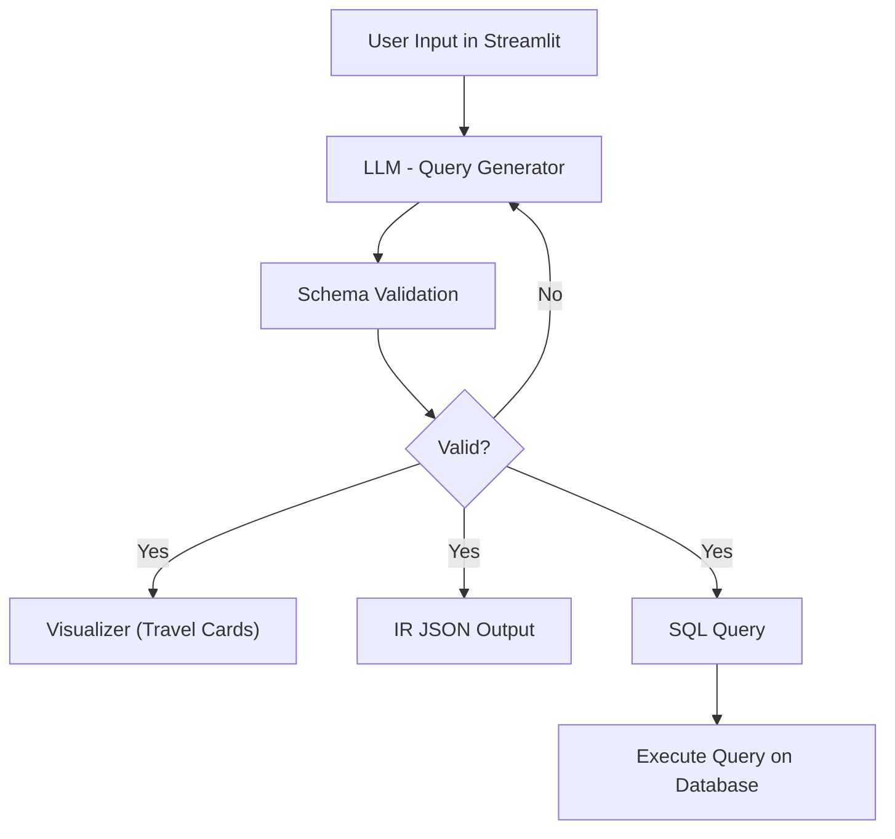

# ml-02-interactive-query-builder

**Project Status:** In Active Development

## Description
A Streamlit-based interface that allows users to define patterns of movement sequences in terms of individual movements and the chronological relationships between them.

The system acts as a translator: it converts natural language prompts into a structured **Intermediate Representation (JSON)**. This JSON is automatically translated into a query language (SQL) to be executed against a database.

## Key Features
- **Dual-Layer Validation:**
    - **Schema Validation:** Ensures the data are in JSON format.
    - **LLM "Judge":** Uses a secondary LLM to assess the accuracy and intent of the generated query.
- **Performance Benchmarking:** Includes a suite to test LLM performance against `data/test_prompts.json` and generate human-readable reports.
- **Self-Correcting Pipeline:** `query_generator.py` employs a retry logic (max 3 attempts) to ensure the LLM output complies with `data/schema.json` and syntactic rules.
- **Visual Verification:** Transforms abstract JSON into UI cards within Streamlit, allowing Border Force officials to see the "lineage" of travel sequences.

## High-Level Architecture / Logic Flow:
1.  **Few-Shot Prompting:** The system uses high-quality examples to guide the LLM's logic.
2.  **Intermediate Representation (IR):** The IR is checked against a strict schema to verify it represents a valid query.
3.  **Visual Representation:** Users verify the query logic via intuitive "Travel Cards" and lineage flows.
4.  **Bidirectional Translation:** The ability to translate between the visual cards and the IR allows users to verify and amend queries—crucial when the initial definition is delegated to an LLM.



Find more info here: [Confluence - Interactive Query Builder](https://confluence.dsa.homeoffice.gov.uk/display/CI/Interactive+Query+Builder)

## Technical File Structure

```plaintext
interactive-query-evaluator/
│
├── core_logic/
│   ├── database.py
│   ├── query_generator.py
│   ├── sql_generator.py
│   ├── visualizer.py
│
├── data/
│   ├── examples/
│   ├── instructions.txt
│   ├── judge_instructions.txt
│   ├── schema.json
│   ├── test_prompts.json
│
├── reports/
│   ├── validation_results.json
│
├── scripts/
│   ├── llm_validator.py
│   ├── report_generator.py
│   ├── validate_schema.py
│
├── tests/
│   ├── test_database.py
│   ├── test_llm_validator.py
│   ├── test_sql_generator.py
│   ├── test_validate_schema.py
│
├── app.py  ← Streamlit app
├── config.py
├── environment.yml
├── README.md
```

## Component Description
### Root Directory
* `app.py`: The entry point. A Streamlit application handling the frontend and user interaction.
* `config.py`: Centralized configuration. Contains LLM model variables and constants used across all scripts.
* `environment.yml`: Conda environment definition.

### Core Logic
* `core_logic/query_generator.py`: The "Brain." Handles LLM prompting, schema validation, and the 3-attempt retry loop.
* `core_logic/visualizer.py`: Transforms JSON output into visual "Travel Cards" for user approval.
* `core_logic/sql_generator.py`: Transforms the JSON output into a Redshift SQL query.
* `core_logic/database.py`: Executes the SQL query and returns a dataframe.

### Data & Schema
* `data/schema.json`: The source of truth for the intermediate representation format. The defined schema to which the LLM's output should comply with.
* `data/instructions.txt`: The system prompt defining how the LLM should interpret movement queries.
* `data/judge_instructions.txt`: Specific instructions for the "Judge" LLM to evaluate accuracy.
* `data/examples/`: Contains `example_001.json` through `005.json`. These are input/output pairs fed into the base system prompt for few-shot learning. It also contains `example_001.sql` through `example_005.sql` for a matching output in sql (tested via tests/test_sql_generator.py)
* `data/test_prompts.json`: A collection of test cases (with and without expected outputs) for benchmarking.

### Scripts & Reporting
* `scripts/validate_schema.py`: A utility to ensure all data files in `/data` comply with the JSON format before execution (syntactic validation)
* `scripts/llm_validator.py`: The "Judge" script that evaluates LLM's output for test prompts on correctness and completeness (schema and semantic validation)
* `scripts/report_generator.py`: A utility to print performance summaries to the terminal for readability purposes
* `reports/`: When running `python scripts/llm_validator.py` the output file (`validation_results.json`) is stored under this directory, tracking the system's accuracy over time. For readability of the results you can run `python scripts/report_gnerator.py` to print them to the terminal

### Tests
* `tests/test_validate_schema.py`: Performs the syntactic validation for all .json files under data/ directory 
* `tests/test_llm_validator.py`: Performs the schema and semantic validation for the function that controls the LLM's output showing in the UI
* `tests/test_sql_generator.py`: Tests the sql_generator.py file with the files under data/examples directory
* `tests/test_database`: Tests that connection exists with the database

## Installation
The project uses Conda for dependency management.

1. **Setup Environment:**
   ```bash
   conda env create -f environment.yml
   conda activate llm-chatbot

## Testing
2. **Run Tests:** To verify the validator logic, run:
    ```bash
    pytest

## Usage
3. **Usage:** Run the following command to start the interface:
    ```bash
    streamlit run app.py
   
